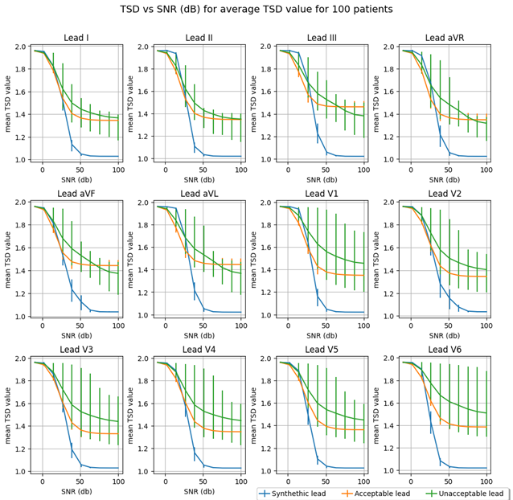
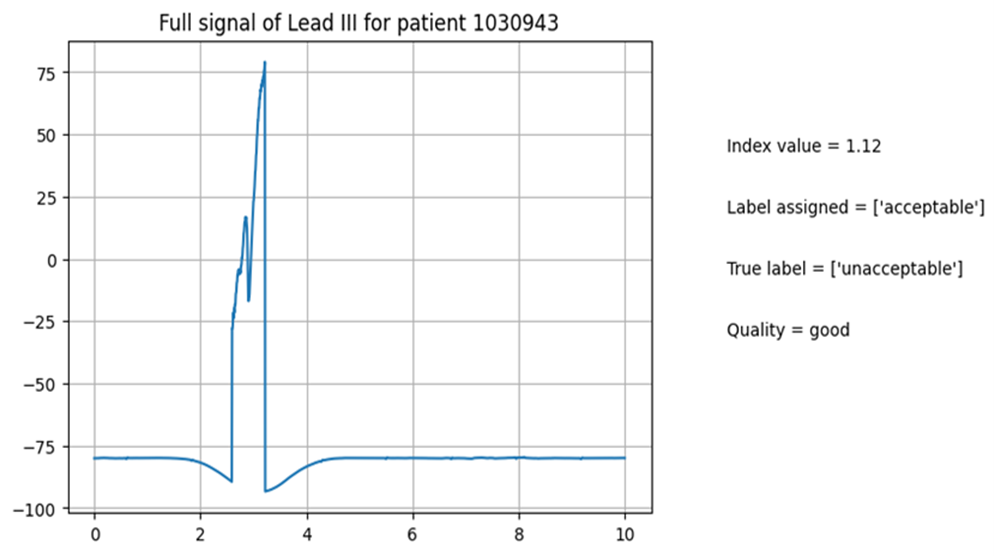
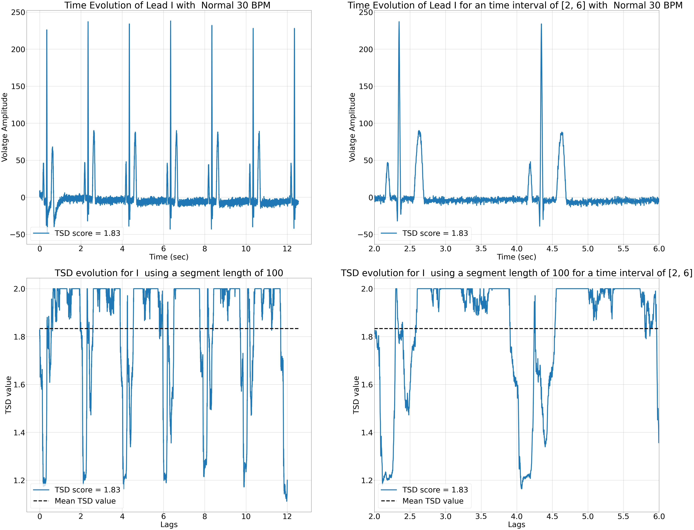

# Additional study : TSD behavior and stability towards noise level

## Introduction

This readme gives more detail results and explanation on our study, in particular  :
    
    1. it gives a graphical comparaison of index and model performance through the use of ROC/PR curve

    2. TSD behavior when confronted to various level of noise for Acceptable, Unacceptable and Synthethic ECG record
    
    3. The TSD evolution of the ECG signal for both healthy and pathological patients

All the results shown here can be reproduce by running the following Notebooks:

    - aggregate_results.ipnyb

    - Attractor_shuffling.ipynb

    - First_trial_test_TSD.ipynb

    - Pathology_TSD.ipynb

    - SNR_ECG_TSD.ipynb

## Part 1 : ROC/PR Curve 

 for all indexes tested as well as the TSD based SQA method. These AUC curves are obtained using our label convention (i.e., unacceptable ECG are the class 1 we want to predict). The AUC value is given in the legend. The black dashed line corresponds to the case where the model has no class separation capacity (with AUC = 0.5)")

One can observe that "r\_interlead" and HR are the indexes of the set that performs very well.  Both share very high precision (93% for both), recall (63% and 66% respectively), F1-score (75% and 77%) and MCC (72% and 73%). These are the highest scores compare to the other features considered. Differences can be seen, however, in their AUC ROC and PR. In this case, “Norm SNR\_ECG  “and “r\_intralead” shows better performance (with an AUC ROC of 88% and 87% and an AUC PR of 78% and 81%). This also visible graphically in Figure 1. On the other hand, TSD has the worst performance of all. This is correlated with previous results, in particular its necessity of having other indexes that certify the presence of ECG dynamic. It has however one of the high precisions among indexes, implying that it can detect correctly unacceptable signals.

## Part 2: TSD behavior in function of noise level

Using the 2011 Physionet dataset, we applied, to the leads, a gaussian noise of specific SNR. This noise was applied to the same lead for 100 ECG records (i.e., we use the lead V1 of 100 patients of a specific category and applied the same gaussian noise to each one). Then we calculate the mean TSD obtained and extract the mean value as well as the 25th and 75th percentile errors. We applied this process for each categories (“acceptable” and “unacceptable”) and also to synthesized ECG leads, using Neurokit library [[1]](#1) . The segment length use for the calculation of TSD was 100 points (0.2 sec for a sampling frequency of 500 Hz).

On Figure 2, for high SNR value, the synthesized ECG leads have a mean TSD value close to 1 (since no noise are present in this signal). We observe that, for low SNR value, all the curves have a similar high TSD value (around 1.9). However, for high SNR level, we observed that some unacceptable have close to lower D value than acceptable lead. This is also observed by the high lower boundary error bars. It can be explained by the fact that, in these unacceptable leads, some signals do not have a PQRST complex. An example is shown on Figure 3. Though no PQRST complex is present, the lead still had a low noise level and is very predictable. This shows us that TSD is independent of the underlying dynamics of the system. For any applications with ECG signals, we must thus preliminarily assess the presence of PQRST complex before using TSD

## Part 3 : The TSD evolution of the ECG signal for both healthy and pathological patients

We also wanted to plot the time evolution of the signal TSD (and get a precise estimation of the mean TSD value of the signal) to see if, in the presence of the ECG waves, would influence the TSD value. Using a 100-timesteps length, we observe changes in the D value at specified event. As shown in FIGURE 5, we can see that at locations of QRS complex is associated with a strong decrease in D value (ex: we pass from a value of 1.3 to 1.05 for the left signal and 1.6 to 1.18 for the right signal). This event can also be seen for other waves (such as T-wave), but the TSD decrease isn’t as pronounced as for QRS complex. 

In addition to detecting part of the signal where QRS complex is present, the mean value of this curve constitutes a good estimation of the noise level in the signal. The QRS complex is well formed but the other waves are hardly visible. The presence of artifacts resulted in higher TSD value in regions outside QRS complex.

## Reference : 
<a id="1">[1]</a>
D. Makowski et al., “NeuroKit2: A Python toolbox for neurophysiological signal processing,” Behav. Res. Methods, vol. 53, no. 4, pp. 1689–1696, Aug. 2021, doi: 10.3758/s13428-020-01516-y.

