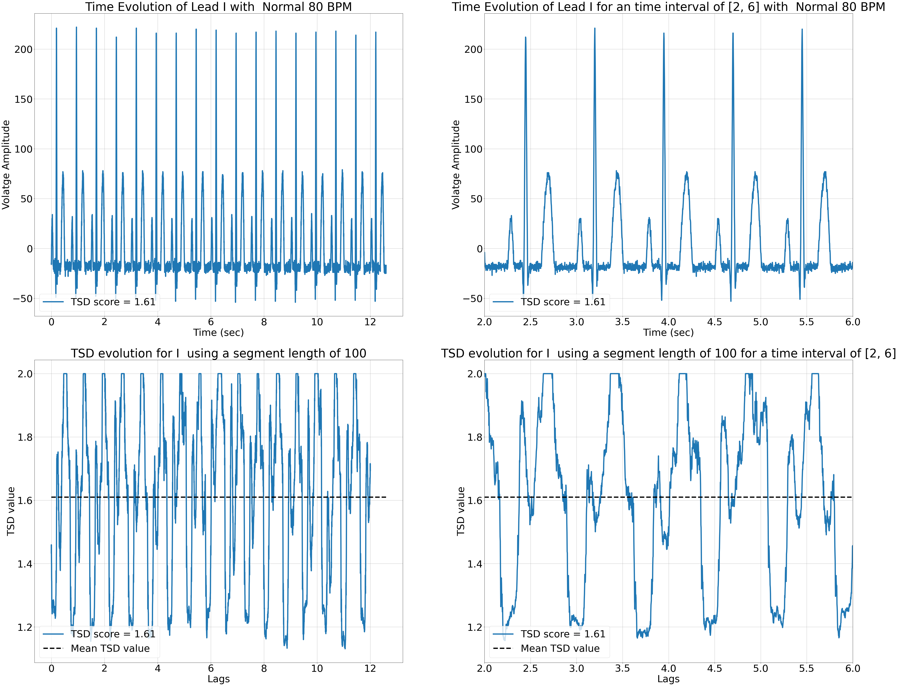

# Additional study : TSD behavior and stability towards noise level

## Introduction

This readme gives more detail results and explanation on our study, in particular  :
    
    1. it gives a graphical comparaison of index and model performance through the use of ROC/PR curve

    2. TSD behavior when confronted to various level of noise for Acceptable, Unacceptable and Synthethic ECG record
    
    3. The TSD evolution of the ECG signal for both healthy and pathological patients

All the results shown here can be reproduce by running the following Notebooks:

    - aggregate_results.ipnyb

    - Attractor_shuffling.ipynb

    - First_trial_test_TSD.ipynb

    - Pathology_TSD.ipynb

    - SNR_ECG_TSD.ipynb

## Part 1 : ROC/PR Curve 
#### Figure 1
 for all indexes tested as well as the TSD based SQA method. These AUC curves are obtained using our label convention (i.e., unacceptable ECG are the class 1 we want to predict). The AUC value is given in the legend. The black dashed line corresponds to the case where the model has no class separation capacity (with AUC = 0.5)")

One can observe that "r\_interlead" and HR are the indexes of the set that performs very well.  Both share very high precision (93% for both), recall (63% and 66% respectively), F1-score (75% and 77%) and MCC (72% and 73%). These are the highest scores compare to the other features considered. Differences can be seen, however, in their AUC ROC and PR. In this case, “Norm SNR\_ECG  “and “r\_intralead” shows better performance (with an AUC ROC of 88% and 87% and an AUC PR of 78% and 81%). This also visible graphically in Figure 1. On the other hand, TSD has the worst performance of all. This is correlated with previous results, in particular its necessity of having other indexes that certify the presence of ECG dynamic. It has however one of the high precisions among indexes, implying that it can detect correctly unacceptable signals.

## Part 2: TSD behavior in function of noise level

Using the 2011 Physionet dataset, we applied, to the leads, a gaussian noise of specific SNR. This noise was applied to the same lead for 100 ECG records (i.e., we use the lead V1 of 100 patients of a specific category and applied the same gaussian noise to each one). Then we calculate the mean TSD obtained and extract the mean value as well as the 25th and 75th percentile errors. We applied this process for each categories (“acceptable” and “unacceptable”) and also to synthesized ECG leads, using Neurokit library [[1]](#1) . The segment length use for the calculation of TSD was 100 points (0.2 sec for a sampling frequency of 500 Hz).
#### Figure 2

On Figure 2, for high SNR value, the synthesized ECG leads have a mean TSD value close to 1 (since no noise are present in this signal). We observe that, for low SNR value, all the curves have a similar high TSD value (around 1.9). However, for high SNR level, we observed that some unacceptable have close to lower D value than acceptable lead. This is also observed by the high lower boundary error bars. It can be explained by the fact that, in these unacceptable leads, some signals do not have a PQRST complex. An example is shown on Figure 3. Though no PQRST complex is present, the lead still had a low noise level and is very predictable. This shows us that TSD is independent of the underlying dynamics of the system. For any applications with ECG signals, we must thus preliminarily assess the presence of PQRST complex before using TSD
#### Figure 3

## Part 3 : The TSD evolution of the ECG signal for both healthy and pathological patients

We also wanted to plot the time evolution of the signal TSD (and get a precise estimation of the mean TSD value of the signal) to see if, in the presence of the ECG waves, would influence the TSD value. Using a 100-timesteps length, we observe changes in the D value at specified event. 

Figure 4 shows TSD evolution for Lead V3 of a patient with a heart rate of 80 BPM. No deformation of the PQRST complex is present and artifact level don’t impact much the ECG dynamic, according to the TSD score.  When looking at TSD evolution for one QRS complex, we observe that each wave is associated with a strong decrease of TSD. The difference between each wave is their amount of TSD decrease: QRS wave complex is the wave associated with the strongest decrease in TSD value (i.e., we pass from a TSD value of 1.4 to 1.08, when entering the QRS complex). It is also the complex where the TSD value become a horizontal line up until the interval exit the QRS complex (i.e., for lags around 2.1 and 2.3, the TSD does not vary much and stay close to a value of 1.08). Following the QRS complex, T-wave has the second greatest decrease in TSD value. P-wave has the lowest TSD decrease observed. No possible shape in its TSD evolution can be observed. This can be explained by its proximity to the QRS complex, which may overshadow it due to the 100-segment length used to calculate it.

In conclusion, we can see that at locations of QRS complex is associated with a strong decrease in D value. This event can also be seen for other waves (such as T-wave), but the TSD decrease isn’t as pronounced as for QRS complex. 
#### Figure 4

#### Figure 5

In addition to detecting part of the signal where QRS complex is present, the mean value of this curve constitutes a good estimation of the noise level in the signal (Figure 5). The QRS complex is well formed but the other waves are hardly visible. The presence of artifacts resulted in higher TSD value in regions outside QRS complex.

### TSD and ECG pathologies : 

Previous results were shown for ECG recording from healthy. We were also interested in seeing the behavior of the TSD for pathological case. We wanted to know if the TSD time evolution could be influenced by changes of ECG waveform and intervals due to pathology (such as Ventricular fibrillation and ESV).
#### Figure 6

Figure 6 shows TSD evolution for Lead I of a patient with a heart rate of 80 BPM. No deformation of the PQRST complex is present. However, outside the PQRST complexe, TSD indicates a high noise level which impact the mean TSD value.  When looking at TSD evolution for one QRS complex, we observe that each wave is associated with a strong decrease of TSD. The difference between each wave is their amount of TSD decrease: QRS wave complex is the wave associated with the strongest decrease in TSD value. In comparison to Figure 4, the patient's heart rate may impact the TSD evolution as well as the window length to use. Indeed, as BPM increase, PQRST complexes gets closer to each other, making it more difficult to distinguish each wave using a 100 length time window. This prooves that windows need not only to be adapted to the optimal condition but also to the BPM at hand.

#### Figure 7

Figure 7 shows lead I evolution for patients with Mobitz 2:1 pathology. In this case, we can perfectly detect the P-wave, in the TSD plot. In addition, Mobitz 2:1 is also well represented in the TSD evolution plot. Indeed, the 2 P-waves are recognizable on the TSD evolution as they share the same shape (with the same variation in TSD amplitude, as observed between lags 1.5 and 3.0). Thus, TSD evolution in time can detect pathological event associated with AV conduction blockage.
#### Figure 8
 due to excitable node, that send a shock after two heartbeats. Trigeminism is characterized by presence of additional P-wave (noted P’) which is followed by a PVC).")
#### Figure 9
 due to excitable node, that send a shoch after one heartbeat).")

FIGURE 8 shows lead I of a patient with Trigeminism pathology. We observe that, using the TSD evolution graph, we can detect the anomalous QRS complex. This is characterized by the absence of P and T wave motifs in the TSD graph at this range. Not only does the TSD can characterized any change in the PQRST complex, but it can also detect enlargement of the QRS complex itself, as it can be seen on FIGURE 9.
#### Figure 10
.")

The last pathology we tested was Ventricular Fibrillation. As shown on FIGURE 10, the TSD plot resemble a sinusoid function, with each minimum being the depolarization of the ventricle. 

Though when looking at the TSD time evolution of the signal, we were also able to detect specific dynamic associated with the ECG waveforms, we were mainly limited by the segment length used. To calculate the TSD at a specific signal time point, we extracted a 100 timesteps  of the signal and applied the formula on it. The 100 points was the lowest segment length we could use, as we found TSD value instabilities start to appear below this. This can also be extended for Hurst Exponent, as indexes calculating long term correlation in the signal are dependent on the time series size used to calculate them [[2]]. This limitation caused TSD time evolution to have lags span lower than the signal time span. Then, TSD evolution associated to a specific wave to by impacted by the presence of other nearby waves, as well as the amplitude of the waves. This is the case of the P-wave in the PQRST complex and is visible in FIGURE 4 and FIGURE 5. In these figures, P-wave TSD value evolution is masked by the QRS complex one, due to their proximity and their difference in amplitude. Finally, we looked at TSD time evolution for lead signal with specific pathologies. Though we observed specific pattern of TSD evolution in presence of pathologies, this was only made for specific pathologies. Plus, we didn’t evaluate if this difference were statistically different between pathological and healthy ECG. Further research in that scope should be done to prove these observations.

## Reference : 
<a id="1">[1]</a>
D. Makowski et al., “NeuroKit2: A Python toolbox for neurophysiological signal processing,” Behav. Res. Methods, vol. 53, no. 4, pp. 1689–1696, Aug. 2021, doi: 10.3758/s13428-020-01516-y.

<a id="2">[2]</a>
A. V. Coronado Jiménez and P. Carpena, “Size Effects on Correlation Measures,” J. Biol. Phys., vol. 31, pp. 121–33, Jan. 2005, doi: 10.1007/s10867-005-3126-8.